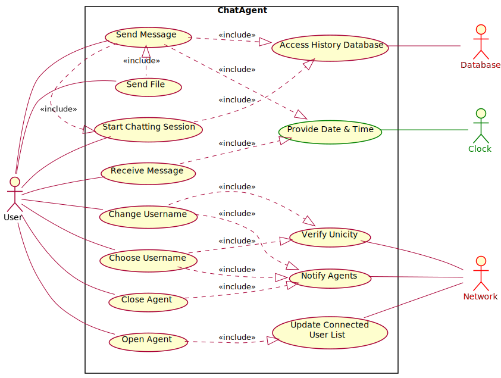

# Decentralized-chat-system

Cette application a pour objectif la communication sur des réseaux informatiques internes ou externes à une entreprise de manière décentralisée donc avec une base de donnée commune requise pour l'authentification ainsi que la récupération des messages échangés lors d'une ancienne session de clavardage.

La messagerie permet l'envoi et la réception de messages en connexion TCP ainsi que leur affichage sur un historique. L'utilisateur peut échanger avec n'importe quel autre utilisateur connecté sur le même réseau et récupérer un historique des anciens messages à sa connexion. L'utilisateur choisit également un pseudo personnel unique et modifiable qui est l'identitée qui sera présentée aux autres utilisateurs.

La connexion ainsi que déconnexion et le changement de pseudo,le choix d'un identifiant unique de chaque utilisateur est signalée via des envoies de trames broadcast UDP.

Pour l'utilisation de ce programme, il n'y a pas de connaissance à avoir en informatique.

# NOTICE D'UTILISATION DU CHAT SYSTEME EN MODE NORMAL

Pour se connecter au système de chat :
Sur la fenetre de connexion:

	1. Entre votre nom d'utilisateur
	2. Selectionner la connexion à la base de donnée ou non
	3. Si non appuyer sur connexion pour lancer l'agent
	3. Si oui cocher si vous voulez vous incrire "Sign up" ou s'identifier "Sign in" 
	4. Entre votre ID et votre mot de passe

Ouvrir une conversation avec un autre utilisateur :
Pour envoyer un message :

	1. Selectionner un contact dans liste des utilisateurs
	2. Ecrire votre message dans la zone de texte
	3. Cliquer sur "Send" pour établir la connexion et envoyer le message
 	
Pour envoyer un fichier (NON FONCTIONNEL) :
Se rendre dans la fenetre de conservation avec un autre utilisateur :

	1. Selectionner un contact dans liste des utilisateurs
	2. Cliquer sur "Send file"
	3. Choisir le fichier à envoyer
	4. Cliquer sur ouvrir pour envoyer le fichier
 
Pour changer de pseudo :

	1. Cliquer sur "Change name"
	2. Entrer un nouveau pseudo valide
	3. Cliquer sur "Change name"
  
Pour se déconnecter :

	1. Cliquer sur "Disconnect" pour retourner à la page de connexion
  
Pour fermer l'application de chat :
 
	1. Cliquer sur Exit dans la fenêtre de connexion
  
 Si vous avez besoin de plus d'aide, appeler le service informatique au 3838.

 
# NOTICE D'UTILISATION DU CHAT SYSTEME EN MODE DEBUG

Afin de pouvoir travailler en parallèle sur le backend (Valentin) et le frontend (Lauric), il existe un mode de lancement entièrement textuel dans un terminal.
Il suffit de lancer le programme avec un argument quelconque ("arg" par exemple). Les commandes sont disponibles avec la commande "help".

Par ailleurs, il est possible de lancer l'agent en mode graphique tout en aillant des détails sur l'exécution. Pour cela, il faut lancer le programme avec l'argument "gui_debug".

Use Case Diagram : 

Black Box Sequence Diagram : 

White Box Sequence Diagram : 

Class Diagram : 

Pour tester :
https://developers.redhat.com/blog/2018/10/22/introduction-to-linux-interfaces-for-virtual-networking#bonded_interface
https://unix.stackexchange.com/questions/152331/how-can-i-create-a-virtual-ethernet-interface-on-a-machine-without-a-physical-ad
https://www.baeldung.com/java-network-interfaces

