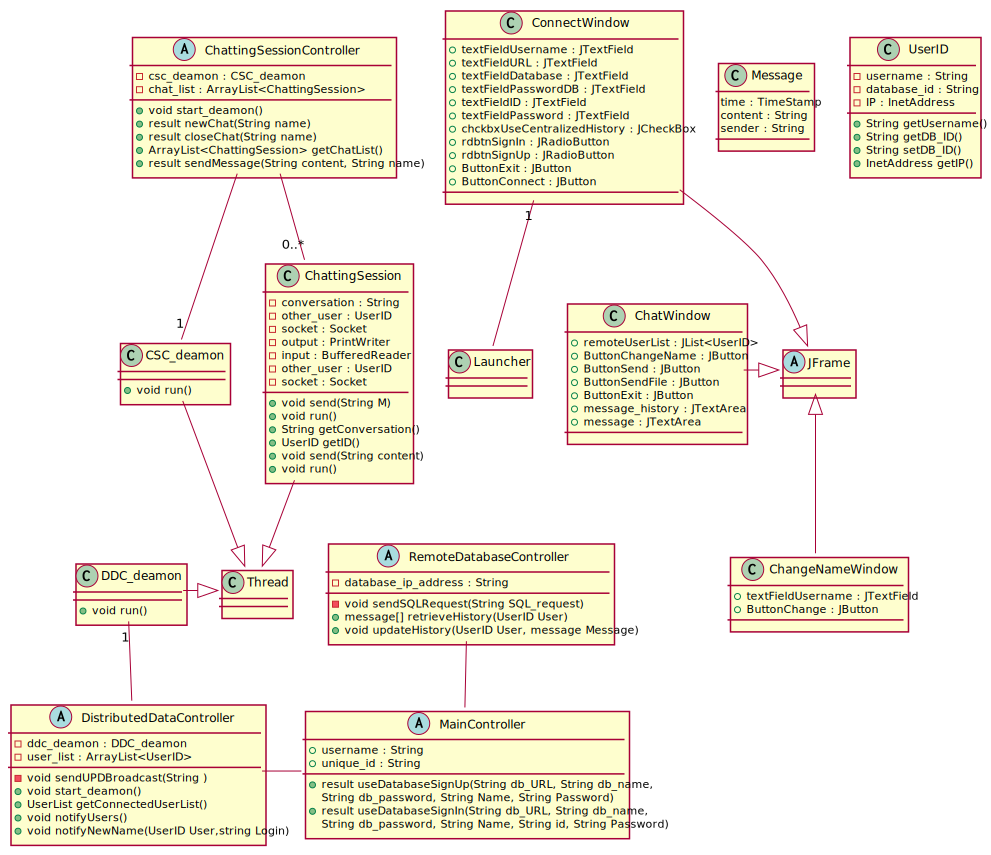

# decentralized-chat-system

Use Case Diagram : 

Black Box Sequence Diagram : 

White Box Sequence Diagram : 

Class Diagram : 

Pour tester :
https://developers.redhat.com/blog/2018/10/22/introduction-to-linux-interfaces-for-virtual-networking#bonded_interface
https://unix.stackexchange.com/questions/152331/how-can-i-create-a-virtual-ethernet-interface-on-a-machine-without-a-physical-ad
https://www.baeldung.com/java-network-interfaces
